# 🚀 자유 주제 자동화 설계 및 구현 보고서

---

## 📌 기본 정보

| 항목 | 내용 |
|------|------|
| 작성일 | 2026-07-22 |
| 작성자 | 최시원 |
| 선정 도구 | n8n |
| 자동화 주제 | 시험 채점 + 합격 여부 기록 및 통보 자동화 + 오답 AI 피드백 |

---

## 1️⃣ 자동화할 반복 업무 정의

### 어떤 반복 업무인가?
구글 폼에 시험 응답이 제출될 때마다, 자동으로 점수를 계산하고 정회원 / 준회원 / 불합격으로 분류하여 스프레드시트에 기록한다. 분류 결과에 따라 응시자에게 디스코드를 통해 결과를 자동 발송하며, 준회원과 불합격자에게는 AI가 오답 피드백을 생성하여 함께 전송한다. 불합격자에게는 7일 후 재시험 안내 메시지도 자동으로 발송된다.

---

## 2️⃣ 도구 선정 및 선정 이유

| 항목 | 내용 |
|------|------|
| 선정 도구 | n8n |
| 선정 이유 | ① 무료 범위 : Wait 노드로 장시간 대기를 걸어도 오퍼레이션 소모 개념이 없어, 7일 후 재시험 안내 예약 발송 구조를 무료 범위 안에서 안정적으로 운영 가능 ② 데이터 처리 유연성 : Google Forms에서 0점이 빈 값으로 들어오는 비정형 데이터를 Set 노드에서 표현식으로 보정할 수 있어 예외 처리에 유리 ③ 조건 분기 제어 : Switch 노드가 위에서부터 순서대로 조건을 검사해 첫 매칭 경로로만 흐르기 때문에, 정회원 / 준회원 / 불합격 3단계 분기를 명확하게 제어 가능 |
| 검토했으나 제외한 도구 | Make — 점수가 "100 / 100" 텍스트로 들어오는 등 데이터 타입 이슈가 반복 발생했고, 해결을 위해 함수를 여러 겹 중첩해야 해 유지보수가 복잡해질 우려가 있어 제외 |

---

## 3️⃣ 워크플로우 설계

### 워크플로우 한 줄 요약
[Google Forms 응답 수신] → [Set으로 데이터 정규화] → [Switch로 점수 분기]
→ 정회원(100점) / 준회원(60~99점) / 불합격(60점 미만)
→ [시트 저장] + [AI 피드백] + [디스코드 알림] + [불합격자 7일 후 재시험 안내]


### 워크플로우 구성 요소

| 구성 요소 | 내용 |
|-----------|------|
| **Trigger** | Google Forms에 응답이 제출되면 워크플로우 시작 |
| **조건 분기 (Switch)** | 총점 기준으로 3개 경로 분기 — 100점 → 정회원 / 60~99점 → 준회원 / 60점 미만 → 불합격 |
| **Action 1** | 분류별 Google Sheets에 응시자 정보 및 점수 저장 |
| **Action 2** | 디스코드 채널에 채점 결과 알림 전송 (준회원·불합격자에게 AI 생성 피드백 함께 전송) |
| **Action 3** | 불합격자 대상 — Wait 노드로 7일 대기 후 재시험 안내 디스코드 알림 전송 |

### 워크플로우 흐름 다이어그램 / 설명

```
[Trigger] Google Forms 응답 수신
    ↓
[Set] 데이터 정규화 (빈 값 → 0점 보정, 오답 문항 계산)
    ↓
[Switch] 총점 기준 분기
    ├─ 100점 → [Sheets 저장] → [결과 디스코드 알림]
    ├─ 60~99점  → [Sheets 저장] → [AI 피드백 생성] → [AI 피드백 + 결과 디스코드 알림]
    └─ 60점 미만 → [Sheets 저장] → [AI 피드백 생성] → [AI 피드백 + 결과 디스코드 알림]
                                                              ↓
                                                         [Wait 7일]
                                                              ↓
                                                    [재시험 안내 디스코드 알림]
```

## 4️⃣ 구현 내용

### 구현 과정 요약

1. Google Forms로 시험 응답을 수신하는 Trigger 노드 설정
2. Set 노드로 빈 응답을 0점으로 보정하고 오답 문항 계산
3. Switch 노드로 총점 기준 3개 경로(정회원·준회원·불합격) 분기 처리
4. 각 경로별 Google Sheets에 응시자 정보 및 점수 저장
5. 준회원·불합격자 대상 AI 피드백 생성 후 디스코드 알림에 포함하여 전송
6. 불합격자 대상 Wait 노드로 7일 대기 후 재시험 안내 디스코드 알림 전송

### 구현 화면

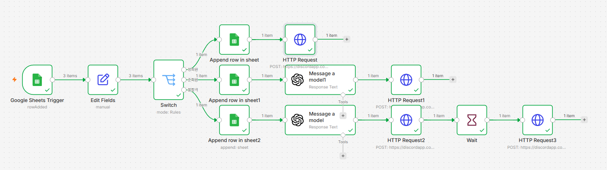

---

## 5️⃣ 실행 결과

---

### 🔵 응답 시트

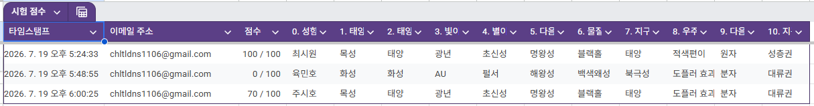

### 🔵 케이스 1 — 정회원 (만점, 100점)

① 정회원 명단 탭 기록

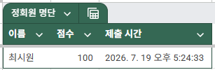

② Discord 정회원 합격 알림


---

### 🔵 케이스 2 — 준회원 (60~99점)

① 준회원 명단 탭 기록

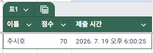

② OpenAI 피드백 생성 결과

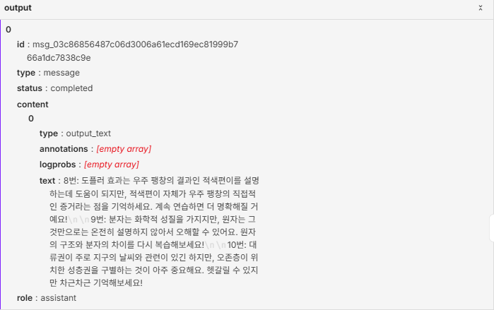

③ Discord 준회원 합격 + AI 피드백 알림

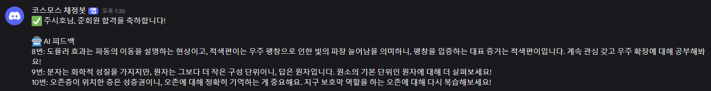

---

### 🔵 케이스 3 — 불합격 (0~59점)

① 재시험 대기 명단 탭 기록

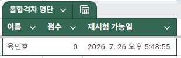

② OpenAI 피드백 생성 결과

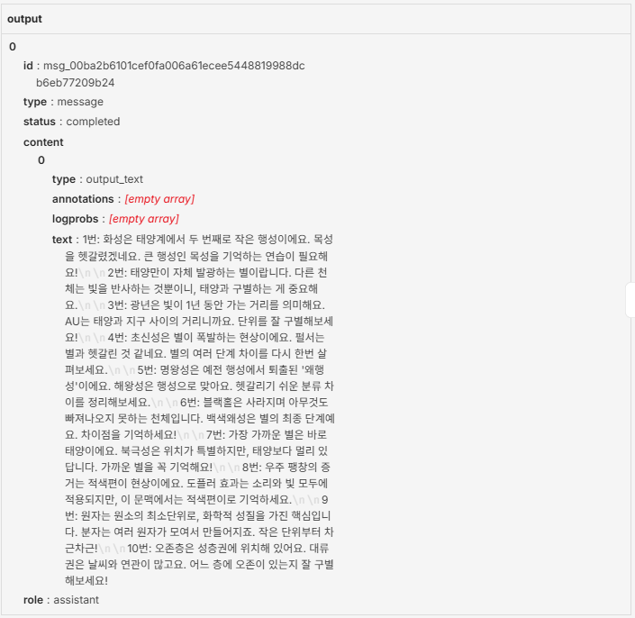

③ Discord 불합격 안내 + AI 피드백 알림

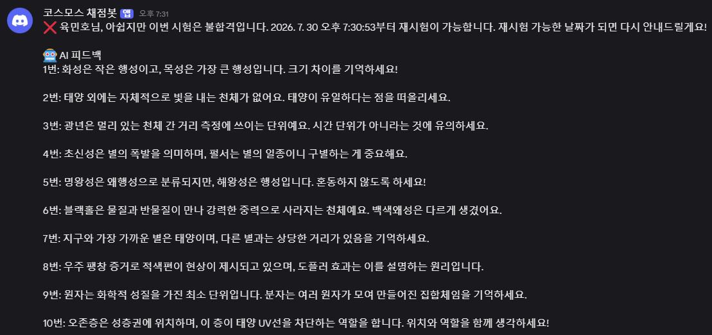

④ Discord 재시험 안내 알림 (Wait 경과 후)

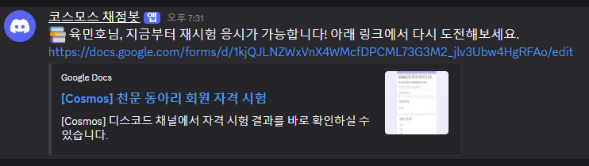

---

### Executions 탭 전체 목록

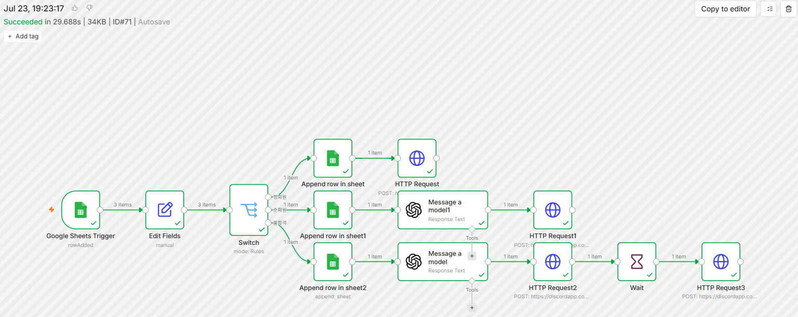

---

## 6️⃣ 구현 중 특이사항 / 어려웠던 점

> - n8n의 AI 노드(OpenAI) 사용 시 크레딧 소진 문제가 있어,
>   피드백 생성은 불합격·준회원 경우에만 호출되도록 조건 분기 설계
>
> - Google Forms 응답값이 빈 칸일 경우 null로 수신되어
>   Set 노드에서 명시적으로 0점 처리하는 보정 로직 추가
>
> - Switch 노드 조건 설정 시 경계값(60점, 100점) 기준을
>   명확히 구분하지 않으면 중복 분기될 수 있어 조건 순서 주의 필요
>
> - Wait 노드(7일 대기) 특성상 실제 테스트가 어려워
>   대기 시간을 1분으로 줄여 동작 확인 후 7일로 재설정

---

## 7️⃣ (보너스) AI 연동

### AI 연동
- **모델**: OpenAI GPT-4o mini
- **Action**: 불합격(60점 미만) 및 준회원(60~99점) 응시자를 대상으로
  틀린 문제 항목을 분석하여 개인별 피드백 문구 자동 생성
- **활용 방식**: Switch 노드에서 해당 분기로 넘어온 경우에만
  OpenAI 노드를 호출하여 불필요한 크레딧 소진 방지
---

## 📎 첨부 파일 목록

| 파일명 | 설명 |
|--------|------|
| `project1.png` | 구현 화면 |
| `project2~12.png` ~ | 실행 결과 화면 |
