# 📊 자동화 도구 비교 구현 보고서

---

## 📌 기본 정보

| 항목 | 내용 |
|------|------|
| 작성일 | 2026-07-19 |
| 작성자 | 최시원 |
| 구현 도구 | n8n / Make |
| 워크플로우 주제 | 시험 채점 + 합격 여부 기록 및 통보 자동화  |

---

## 1️⃣ 구현한 워크플로우 개요

### 워크플로우 한 줄 요약:

```
Google Form 제출(자체 채점) → 점수 3단계 조건 분기 → Google Sheets 명단 기록 + Discord 알림 (불합격자는 7일 뒤 재시험 안내 예약 발송)
```

### 워크플로우 구성 요소

| 구성 요소 | 내용 |
|-----------|------|
| **Trigger** | Google Form 응답 제출 시 (Google Sheets 응답 시트에 새 행 추가되는 것을 감지) |
| **조건 분기 (Filter/Router)** | 정답 개수 기준 3단계 분기 — 정회원(10개) / 준회원(6~9개) / 불합격(0~5개) |
| **Action 1** | Google Sheets 명단 기록 (정회원/준회원은 각 명단 탭에, 불합격자는 재시험 대기 명단 탭에 재시험가능일과 함께 기록) |
| **Action 2** | Discord 알림 전송 (정회원/준회원 합격 알림, 불합격자 안내 알림) |
| **Action 3** | 불합격자에게 7일 후 재시험 가능 안내 메시지 예약 발송 (Wait/Sleep 노드 활용) |

---

## 2️⃣ 워크플로우 상세 설계

### Google Form 질문 항목

| 질문 | 입력 유형 |
|------|-----------|
| 이름 | 단답형 |
| 1번 문제 | 객관식 (①②③④) |
| 2번 문제 | 객관식 (①②③④) |
| 3번 문제 | 객관식 (①②③④) |
| 4번 문제 | 객관식 (①②③④) |
| 5번 문제 | 객관식 (①②③④) |
| 6번 문제 | 객관식 (①②③④) |
| 7번 문제 | 객관식 (①②③④) |
| 8번 문제 | 객관식 (①②③④) |
| 9번 문제 | 객관식 (①②③④) |
| 10번 문제 | 객관식 (①②③④) |

---

### 채점 기준

| 항목 | 내용 |
|------|------|
| 문제 수 | 10문제 |
| 문제당 배점 | 10점 |
| 만점 | 100점 |
| 정답 관리 | Google Forms 자체 퀴즈 기능 (문제별 정답 지정) |
| 채점 방식 | Google Forms의 퀴즈 자동 채점 기능으로 점수 산출 → 응답 시트에 자동 기록 → 자동화 도구(n8n / Make)가 그 점수를 가져와 분기·기록·알림 처리 |

---

### Google Sheets 구성

**① 응답 시트 (자동 생성)**
Google Form과 연결 시 자동으로 생성되는 탭. 이름, 문제별 답, 점수(자동 채점 결과)가 기록됨.

**② 정회원 명단 탭**

| 열 | 내용 |
|----|------|
| A열 | 이름 |
| B열 | 점수 |
| C열 | 제출 시간 |

**③ 준회원 명단 탭**

| 열 | 내용 |
|----|------|
| A열 | 이름 |
| B열 | 점수 |
| C열 | 제출 시간 |

**④ 재시험 대기 명단 탭**

| 열 | 내용 |
|----|------|
| A열 | 이름 |
| B열 | 점수 |
| C열 | 재시험가능일 |

---

### 합격 기준 (3단계 분기)

| 분기 | 정답 개수 | 점수 |
|------|-----------|------|
| 정회원 | 10개 (만점) | 100점 |
| 준회원 | 6~9개 | 60~90점 |
| 불합격 | 0~5개 | 0~50점 |

| 항목 | 내용 |
|------|------|
| 분기 조건 | `점수 == 100` → 정회원 / `점수 >= 60` → 준회원 / `점수 < 60` → 불합격 |

---

### Discord 알림 메시지

**정회원 (만점) 시:**
🌟 [최시원]님, 만점으로 코스모스 정회원이 되신 것을 축하합니다!

**준회원 시:**
✅ [주시호]님, 준회원 합격을 축하합니다!

**불합격 시 (즉시 안내):**
❌ [육민호]님, 아쉽지만 이번 시험은 불합격입니다. 2026. 7. 26 오후 8시 27분부터 재시험이 가능합니다. 재시험 가능한 날짜가 되면 다시 안내드릴게요!

**재시험 안내 시 (7일 후 예약 발송):**
📚 [육민호]님, 지금부터 재시험 응시가 가능합니다! 아래 링크에서 다시 도전해보세요.
(폼 URL)

---

## 3️⃣ 도구별 구현 내용

### 🔵 도구 A – `n8n`

**구현 과정 요약:**

1. Google Sheets Trigger 노드로 폼 응답 시트의 "시험 점수" 탭의 새 행 추가를 감지
2. Code 노드에서 Google Forms 퀴즈 채점 결과 중 0점이 빈 값(" ")으로 들어오는 이슈를 방어 코드로 보정 (빈 값 -> 0 변환)
3. Switch 노드로 점수 기준 3단계 분기 구성 (100점 = 정회원 / 60\~99점 = 준회원 / 0\~59점 = 불합격)
4. 정회원·준회원 branch : Google Sheets (Append Row)로 각 명단 탭에 기록 후 HTTP Request 노드로 Discord 웹 훅에 합격 알림 전송
5. 불합격 branch : Google Sheets (Append Row)로 재시험 대기 명단에 기록 (7일 뒤 재시험 가능일 자동 계산·저장) -> HTTP Request로 불합격 안내 즉시 발송 -> Wait 노드 (실제 운영 시 7일 대기, 테스트 편의상 10초로 설정) -> HTTP Request로 재시험 가능 안내 발송
6. 전체 흐름을 3가지 케이스 (만점 / 중간 점수 / 저점수)로 테스트하여 각 분기와 알림이 정삭 작동하는지 확인

**워크플로우 구성 화면:**

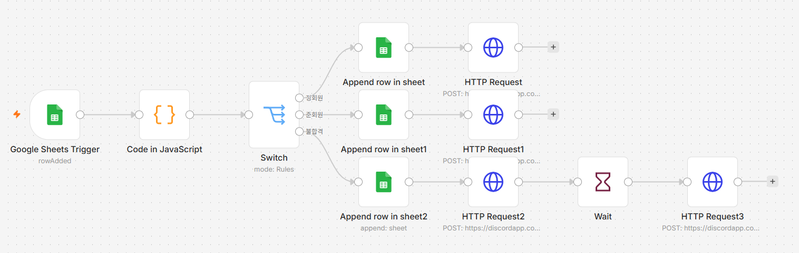

**실행 결과 화면:**

① 응답 시트 (테스트 케이스 3건 제출)

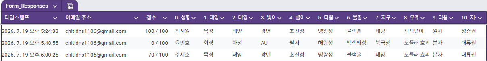

② 정회원 명단 탭 (만점자 기록)

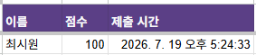

③ 준회원 명단 탭 (중간 점수자 기록)

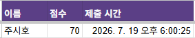

④ 재시험 대기 명단 탭 (불합격자 + 재시험가능일 기록)

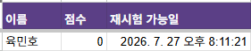

⑤ Discord 즉시 알림 (정회원 / 준회원 / 불합격 안내)

정회원:    


준회원:   


불합격자:    
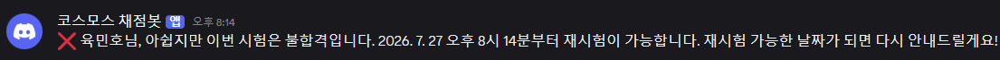

⑥ Discord 재시험 안내 알림 (Wait 7일 경과 후 발송)

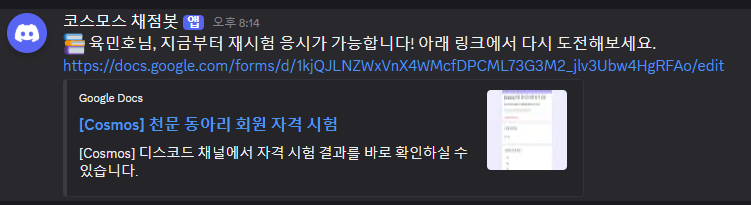

**구현 중 특이사항 / 어려웠던 점:**

> - Google Forms 퀴즈 채점 결과가 0점일 경우 응답 시트에 빈 값으로 기록되는 특이 동작이 있어, 이를 자동화 도구 단에서 방어 코드로 보정해야 했음
> - Code 노드의 실행 모드(Run Once for All Items / Run Once for Each Item)를 잘못 설정하면 첫 번째 행 데이터만 처리되는 문제가 있어 모드 전환이 필요했음
> - HTTP Request 노드는 실행 후 다음 노드로 "요청 응답값"을 넘기기 때문에, 원본 데이터(이름 등)를 그대로 쓰려면 `$('노드이름').item.json[...]` 형태로 이전 노드를 직접 참조해야 했음
> - Discord는 웹훅 방식으로는 특정 채널 전체 공개 알림만 가능하고 개인별 DM은 Bot 토큰 + 사용자 ID 매핑이 추가로 필요해, 이번 과제 범위에서는 채널 알림 방식으로 통일함
> - JSON Body 안에서 정규식을 쓸 때 이스케이프(`\d` vs `\\d`) 처리에 주의가 필요했음
---

### 🟠 도구 B – `[도구 이름]`

**구현 과정 요약:**

1. Google Sheets **Watch Rows** 모듈로 폼 응답 시트의 새 행 추가를 감지
2. **Set Variable** 모듈에서 이름/점수/시간 값을 정리 — 점수는 Google Forms 채점 결과가 "100 / 100" 형식의 텍스트로 들어오고 0점은 빈 값으로 들어오는 이슈가 있어, 문자열 파싱(`substring`, `indexOf`) + 빈값 보정(`ifempty`)으로 순수 숫자만 추출하도록 처리
3. **Router**로 점수 기준 3단계 분기 구성 (100점 = 정회원 / 60~99점 = 준회원 / 0~59점 = 불합격), 각 경로마다 Filter 조건(`>=`, `<`)을 걸어 구현
4. 정회원·준회원 경로 : Google Sheets(**Add a Row**)로 각 명단 탭에 기록 후 HTTP 모듈(**Make a request**)로 Discord 웹훅에 합격 알림 전송
5. 불합격 경로 : Google Sheets(Add a Row)로 재시험 대기 명단에 기록(7일 뒤 재시험 가능일을 날짜 함수로 자동 계산·저장) → HTTP 모듈로 불합격 안내 즉시 발송 → **Sleep** 모듈(실제 운영 시 7일 대기, 테스트 편의상 10초로 설정) → HTTP 모듈로 재시험 가능 안내 발송
6. 전체 흐름을 3가지 케이스(만점 / 중간 점수 / 저점수)로 Run once 테스트하여 각 분기와 알림이 정상 작동하는지 확인

**워크플로우 구성 화면:**

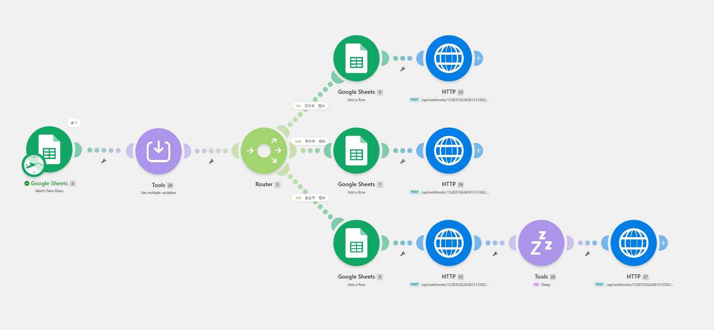

**실행 결과 화면:**

① 응답 시트 (테스트 케이스 3건 제출)

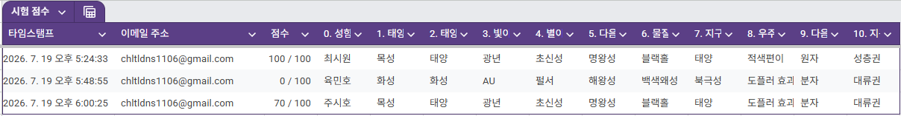

② 정회원 명단 탭 (만점자 기록)

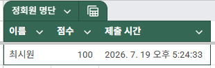

③ 준회원 명단 탭 (중간 점수자 기록)

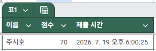

④ 재시험 대기 명단 탭 (불합격자 + 재시험가능일 기록)

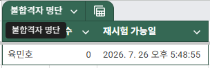

⑤ Discord 즉시 알림 (정회원 / 준회원 / 불합격 안내)

정회원:


준회원:


불합격자:


⑥ Discord 재시험 안내 알림 (Sleep 경과 후 발송)

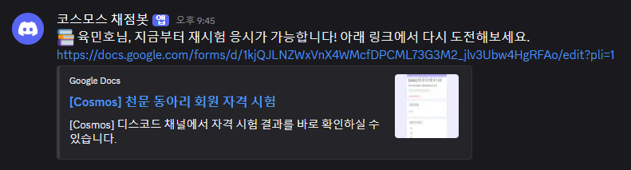

**구현 중 특이사항 / 어려웠던 점:**

> - Google Forms 퀴즈 채점 결과가 "100 / 100"처럼 텍스트 형식으로 들어오고, 0점은 아예 빈 값으로 들어와서 Router 필터의 숫자 비교 조건이 모두 실패하는 문제가 있어, Set Variable 단계에서 문자열 파싱 + 빈값 보정 로직을 추가해야 했음
> - Make의 Router는 n8n의 Switch와 달리 각 경로 조건을 독립적으로 검사하므로, 준회원 경로에 "60 이상 그리고 100 미만" 두 조건을 함께 걸지 않으면 정회원과 경로가 겹치는 문제가 있었음
> - 날짜 계산(`formatDate`, `addDays`, `parseDate`) 시 원본 값이 이미 "오전/오후"가 포함된 한국어 텍스트라 재파싱이 실패하거나, 함수 출력이 영어 소문자(am/pm)로 나오는 등 로케일 관련 이슈가 있어 문자열 치환(`replace`)으로 보정해야 했음
> - Google Sheets에 시간 값을 넣을 때 자동으로 날짜 시리얼 넘버(숫자)로 변환되는 문제가 있어, "Unformatted" 옵션과 텍스트 강제 처리(앞에 작은따옴표 붙이기)로 해결함
> - HTTP 모듈 이후에는 원본 데이터가 아닌 요청 응답값이 넘어오므로, Discord 메시지에서 재시험가능일 같은 계산값을 쓰려면 Google Sheets 매핑 시 썼던 계산식을 그대로 다시 참조해야 했음

---

## 4️⃣ 비교 분석표

> 최소 5개 이상의 항목을 비교하세요.

| 비교 항목 | 🔵 도구 A (``) | 🟠 도구 B (``) |
|-----------|--------------|--------------|
| **UI/UX** | | |
| **설정 난이도** | | |
| **연동 서비스 범위** | | |
| **무료 플랜 제한** | | |
| **실행 로그 / 디버깅** | | |
| **조건 분기 방식** | | |
| **추가 항목** | | |

---

## 5️⃣ 장단점 정리

### 🔵 도구 A – `[도구 이름]`

| | 내용 |
|-|------|
| ✅ **장점** | |
| ❌ **단점** | |

### 🟠 도구 B – `[도구 이름]`

| | 내용 |
|-|------|
| ✅ **장점** | |
| ❌ **단점** | |

---

## 6️⃣ 적합한 상황 분석

> 어떤 상황에서 어떤 도구가 더 적합한지 의견을 작성하세요.

| 상황 | 추천 도구 | 이유 |
|------|-----------|------|
| 빠르게 간단한 자동화가 필요할 때 | | |
| 복잡한 조건 분기가 필요할 때 | | |
| 비개발자가 처음 사용할 때 | | |
| 무료로 최대한 활용하고 싶을 때 | | |
| 세밀한 데이터 제어가 필요할 때 | | |

---

## 7️⃣ 최종 결론

> 이번 비교를 통해 느낀 점과 도구 선택 기준을 자유롭게 작성하세요.

```
(자유 서술)
```

---

## ✅ 체크리스트

> 제출 전 아래 항목을 확인하세요.

- [ ] 두 도구 모두 동일한 워크플로우 구조로 구현했다
- [ ] Trigger 1개 이상 포함되어 있다
- [ ] Action 2개 이상 포함되어 있다
- [ ] 조건 분기(Filter/Router) 1개 이상 포함되어 있다
- [ ] 각 분기 경로가 실제로 1회 이상 실행된 결과를 확인했다
- [ ] 비교 항목이 5개 이상이다
- [ ] 스크린샷에 API Key, 비밀번호 등 민감정보가 노출되지 않았다
- [ ] 계정 이메일을 일부 가림 처리했다 (예: `ab***@gmail.com`)

---

## 📎 첨부 파일 목록

| 파일명 | 설명 |
|--------|------|
| `[도구A]_workflow_screenshot.png` | 도구 A 워크플로우 구성 화면 |
| `[도구A]_result_screenshot.png` | 도구 A 실행 결과 화면 |
| `[도구B]_workflow_screenshot.png` | 도구 B 워크플로우 구성 화면 |
| `[도구B]_result_screenshot.png` | 도구 B 실행 결과 화면 |
